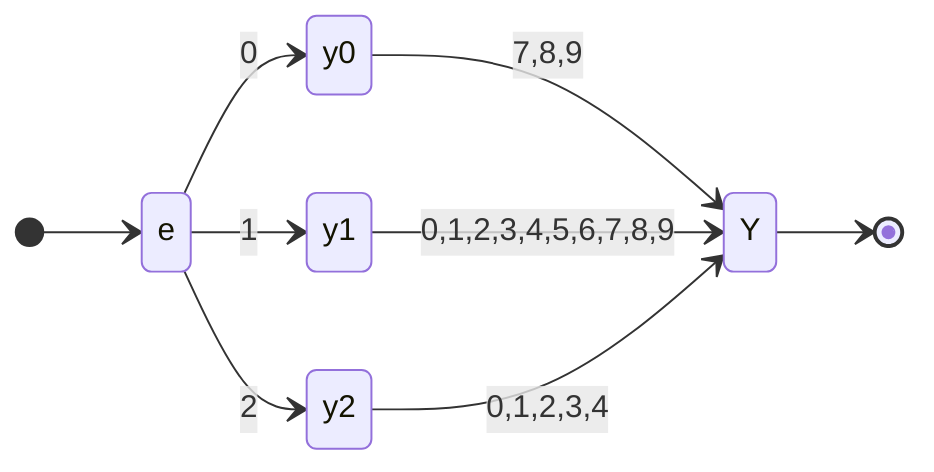
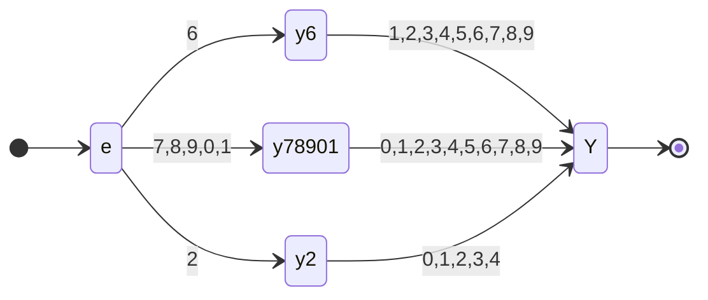
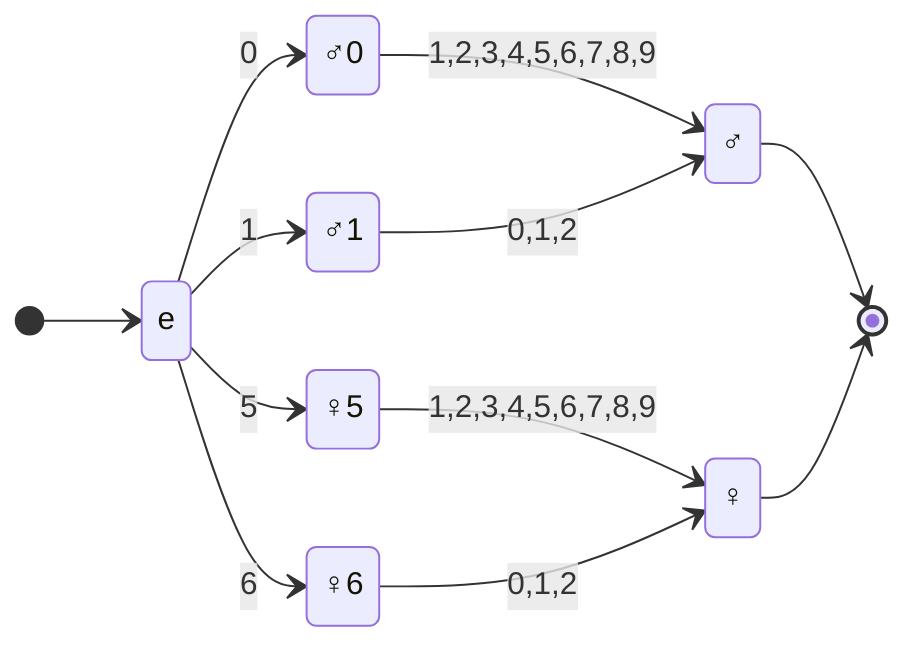
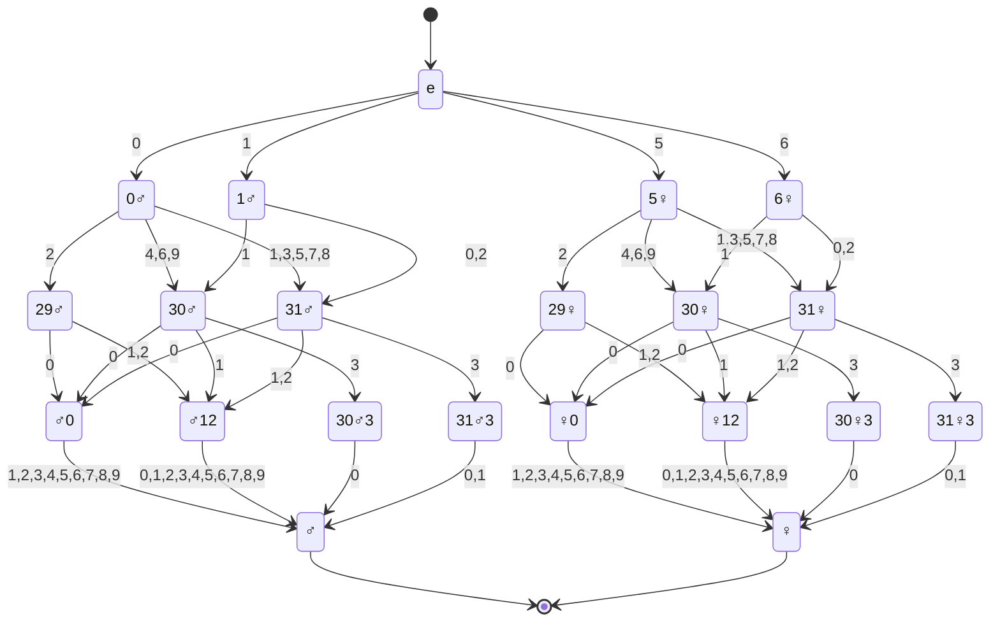
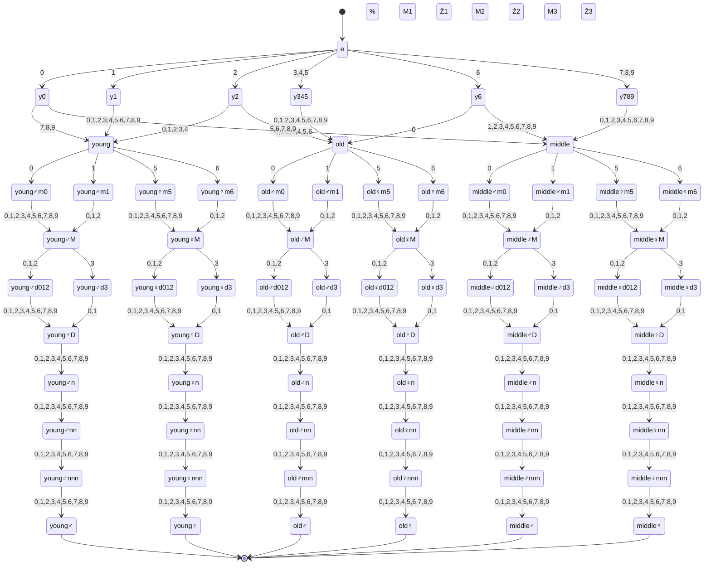

<!-- LTeX: language=cs-CZ -->

# Semestrálka

## Mladší 18 let a validní

```mermaid
stateDiagram-v2
  direction LR
  [*] --> e
  e --> y0 : 0
  e --> y1 : 1
  e --> y2 : 2
  y0 --> Y : 7,8,9
  y1 --> Y : 0,1,2,3,4,5,6,7,8,9
  y2 --> Y : 0,1,2,3,4
  Y --> [*]
```

## Mladší 65 let a validní

```mermaid
stateDiagram-v2
  direction LR
  [*] --> e
  e --> y6: 6
  e --> y78901: 7,8,9,0,1
  e --> y2: 2
  y6 --> Y: 1,2,3,4,5,6,7,8,9
  y78901 --> Y: 0,1,2,3,4,5,6,7,8,9
  y2 --> Y: 0,1,2,3,4
  Y --> [*]
```

## Pohlaví a validní měsíc

```mermaid
stateDiagram-v2
  direction LR
  [*] --> e
  e --> ♂0 : 0
  e --> ♂1 : 1
  e --> ♀5 : 5
  e --> ♀6 : 6
  ♂0 --> ♂ : 1,2,3,4,5,6,7,8,9
  ♂1 --> ♂ : 0,1,2
  ♀5 --> ♀ : 1,2,3,4,5,6,7,8,9
  ♀6 --> ♀ : 0,1,2
  ♂ --> [*]
  ♀ --> [*]
```

## Validní den

```mermaid
stateDiagram-v2
  [*] --> e
  e --> 0♂ : 0
  e --> 1♂ : 1
  e --> 5♀ : 5
  e --> 6♀ : 6

  0♂ --> 29♂ : 2
  0♂ --> 30♂ : 4,6,9
  0♂ --> 31♂ : 1,3,5,7,8
  1♂ --> 30♂ : 1
  1♂ --> 31♂ : 0,2

  5♀ --> 29♀ : 2
  5♀ --> 30♀ : 4,6,9
  5♀ --> 31♀ : 1,3,5,7,8
  6♀ --> 30♀ : 1
  6♀ --> 31♀ : 0,2

  29♂ --> ♂0 : 0
  29♂ --> ♂12 : 1,2
  30♂ --> ♂0 : 0
  30♂ --> ♂12 : 1
  30♂ --> 30♂3 : 3
  31♂ --> ♂0 : 0
  31♂ --> ♂12 : 1,2
  31♂ --> 31♂3 : 3
  ♂0 --> ♂ : 1,2,3,4,5,6,7,8,9
  ♂12 --> ♂ : 0,1,2,3,4,5,6,7,8,9
  30♂3 --> ♂ : 0
  31♂3 --> ♂ : 0,1

  29♀ --> ♀0 : 0
  29♀ --> ♀12 : 1,2
  30♀ --> ♀0 : 0
  30♀ --> ♀12 : 1
  30♀ --> 30♀3 : 3
  31♀ --> ♀0 : 0
  31♀ --> ♀12 : 1,2
  31♀ --> 31♀3 : 3
  ♀0 --> ♀ : 1,2,3,4,5,6,7,8,9
  ♀12 --> ♀ : 0,1,2,3,4,5,6,7,8,9
  30♀3 --> ♀ : 0
  31♀3 --> ♀ : 0,1

  ♂ --> [*]
  ♀ --> [*]
```

## Validní všechno (post konzultační)

```mermaid
%% active
stateDiagram-v2
  %% Σ 0,1,2,3,4,5,6,7,8,9

  %% age

  [*] --> e % e
  e --> y0 : 0
  e --> y1 : 1
  e --> y2 : 2
  e --> y345 : 3,4,5
  e --> y6 : 6
  e --> y789 : 7,8,9

  y0 --> young : 7,8,9
  y0 --> middle : 0,1,2,3,4,5,6

  y1 --> young : 0,1,2,3,4,5,6,7,8,9

  y2 --> young : 0,1,2,3,4
  y2 --> old : 5,6,7,8,9

  y345 --> old : 0,1,2,3,4,5,6,7,8,9

  y6 --> old : 0
  y6 --> middle : 1,2,3,4,5,6,7,8,9

  y789 --> middle : 0,1,2,3,4,5,6,7,8,9

  %% young sex

  young --> young♂m0 : 0
  young --> young♂m1 : 1

  young♂m0 --> young♂M : 0,1,2,3,4,5,6,7,8,9
  young♂m1 --> young♂M : 0,1,2


  young --> young♀m5 : 5
  young --> young♀m6 : 6
  young♀m5 --> young♀M : 0,1,2,3,4,5,6,7,8,9
  young♀m6 --> young♀M : 0,1,2

  %% middle sex

  middle --> middle♂m0 : 0
  middle --> middle♂m1 : 1

  middle♂m0 --> middle♂M : 0,1,2,3,4,5,6,7,8,9
  middle♂m1 --> middle♂M : 0,1,2


  middle --> middle♀m5 : 5
  middle --> middle♀m6 : 6
  middle♀m5 --> middle♀M : 0,1,2,3,4,5,6,7,8,9
  middle♀m6 --> middle♀M : 0,1,2

  %% old sex

  old --> old♂m0 : 0
  old --> old♂m1 : 1

  old♂m0 --> old♂M : 0,1,2,3,4,5,6,7,8,9
  old♂m1 --> old♂M : 0,1,2


  old --> old♀m5 : 5
  old --> old♀m6 : 6
  old♀m5 --> old♀M : 0,1,2,3,4,5,6,7,8,9
  old♀m6 --> old♀M : 0,1,2

  %% young male day

  young♂M --> young♂d012 : 0,1,2
  young♂M --> young♂d3 : 3
  young♂d012 --> young♂D : 0,1,2,3,4,5,6,7,8,9
  young♂d3 --> young♂D : 0,1

  %% young female day

  young♀M --> young♀d012 : 0,1,2
  young♀M --> young♀d3 : 3
  young♀d012 --> young♀D : 0,1,2,3,4,5,6,7,8,9
  young♀d3 --> young♀D : 0,1

  %% middle male day

  middle♂M --> middle♂d012 : 0,1,2
  middle♂M --> middle♂d3 : 3
  middle♂d012 --> middle♂D : 0,1,2,3,4,5,6,7,8,9
  middle♂d3 --> middle♂D : 0,1

  %% middle female day

  middle♀M --> middle♀d012 : 0,1,2
  middle♀M --> middle♀d3 : 3
  middle♀d012 --> middle♀D : 0,1,2,3,4,5,6,7,8,9
  middle♀d3 --> middle♀D : 0,1

  %% old male day

  old♂M --> old♂d012 : 0,1,2
  old♂M --> old♂d3 : 3
  old♂d012 --> old♂D : 0,1,2,3,4,5,6,7,8,9
  old♂d3 --> old♂D : 0,1

  %% old female day

  old♀M --> old♀d012 : 0,1,2
  old♀M --> old♀d3 : 3
  old♀d012 --> old♀D : 0,1,2,3,4,5,6,7,8,9
  old♀d3 --> old♀D : 0,1


  %% young male number

  young♂D --> young♂n : 0,1,2,3,4,5,6,7,8,9
  young♂n --> young♂nn : 0,1,2,3,4,5,6,7,8,9
  young♂nn --> young♂nnn : 0,1,2,3,4,5,6,7,8,9
  young♂nnn --> young♂ : 0,1,2,3,4,5,6,7,8,9
  young♂ --> [*] % M1

  %% young female number

  young♀D --> young♀n : 0,1,2,3,4,5,6,7,8,9
  young♀n --> young♀nn : 0,1,2,3,4,5,6,7,8,9
  young♀nn --> young♀nnn : 0,1,2,3,4,5,6,7,8,9
  young♀nnn --> young♀ : 0,1,2,3,4,5,6,7,8,9
  young♀ --> [*] % Ž1

  %% middle male number

  middle♂D --> middle♂n : 0,1,2,3,4,5,6,7,8,9
  middle♂n --> middle♂nn : 0,1,2,3,4,5,6,7,8,9
  middle♂nn --> middle♂nnn : 0,1,2,3,4,5,6,7,8,9
  middle♂nnn --> middle♂ : 0,1,2,3,4,5,6,7,8,9
  middle♂ --> [*] % M2

  %% middle female number

  middle♀D --> middle♀n : 0,1,2,3,4,5,6,7,8,9
  middle♀n --> middle♀nn : 0,1,2,3,4,5,6,7,8,9
  middle♀nn --> middle♀nnn : 0,1,2,3,4,5,6,7,8,9
  middle♀nnn --> middle♀ : 0,1,2,3,4,5,6,7,8,9
  middle♀ --> [*] % Ž2

  %% old male number

  old♂D --> old♂n : 0,1,2,3,4,5,6,7,8,9
  old♂n --> old♂nn : 0,1,2,3,4,5,6,7,8,9
  old♂nn --> old♂nnn : 0,1,2,3,4,5,6,7,8,9
  old♂nnn --> old♂ : 0,1,2,3,4,5,6,7,8,9
  old♂ --> [*] % M3

  %% old female number

  old♀D --> old♀n : 0,1,2,3,4,5,6,7,8,9
  old♀n --> old♀nn : 0,1,2,3,4,5,6,7,8,9
  old♀nn --> old♀nnn : 0,1,2,3,4,5,6,7,8,9
  old♀nnn --> old♀ : 0,1,2,3,4,5,6,7,8,9
  old♀ --> [*] % Ž3
```
